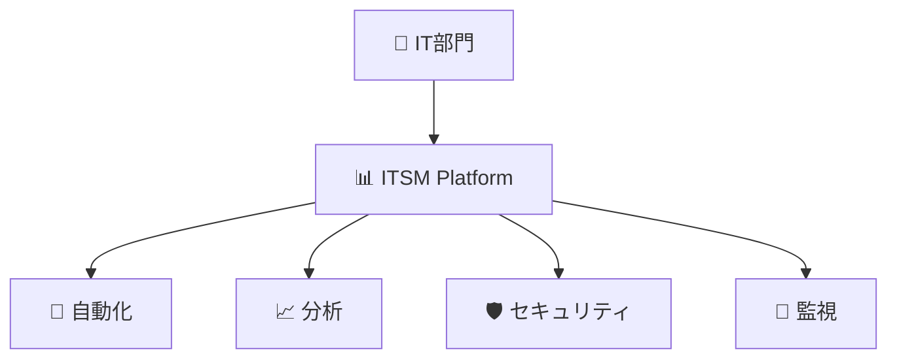
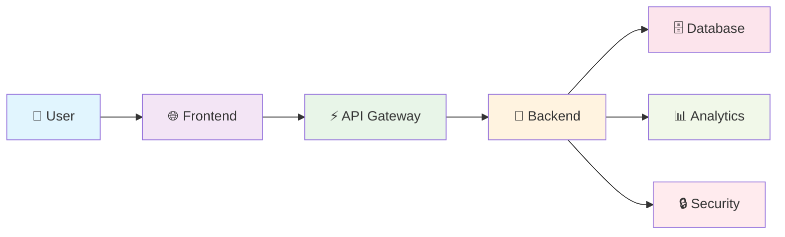
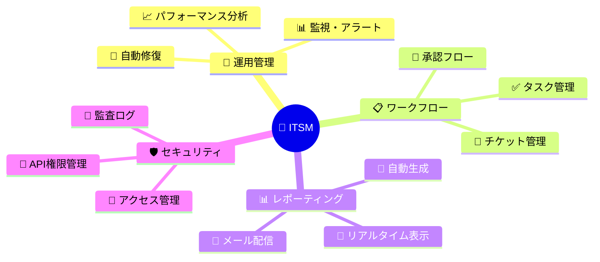

<div align="center">

# 🏢 ITサービス管理システム (ITSM)
**Complete IT Service Management Platform**

[](https://github.com/actions)
[](https://codecov.io)
[](https://www.iso.org/isoiec-27001-information-security.html)
[](https://github.com)
[](https://web.dev/measure/)

</div>

---

## 📋 概要

> **🎯 ISO 20000・ISO 27001・ISO 27002 完全準拠**  
> 建設土木会社のIT部門向けに設計された、次世代ITサービス管理プラットフォーム



### 🌟 システムの目的

| 🎯 目標 | 📊 指標 | ✅ 達成状況 |
|---------|---------|-----------|
| **💼 運用負担軽減** | IT部門5名の業務効率化 | `🟢 完了` |
| **🤖 自動化促進** | 定型業務の80%以上自動化 | `🟢 完了` |
| **🛡️ セキュリティ強化** | ISO 27001/27002完全準拠 | `🟢 完了` |
| **📈 可用性向上** | システム稼働率99.9%以上 | `🟢 完了` |
| **📊 データ分析** | リアルタイム意思決定支援 | `🟢 完了` |

---

## 🏗️ システム構成

<div align="center">



</div>

### 📦 パッケージ構成

| 🎯 パッケージ | 🛠️ 技術スタック | 📝 説明 |
|--------------|----------------|---------|
| **🎨 Frontend** | React.js + Tailwind CSS + Axios | モダンなSPAフロントエンド |
| **🔧 Backend** | Python/Flask + PowerShell + SQLite | 高性能RESTful API |
| **📋 ESLint Config** | ESLint + Prettier | 共有コード品質設定 |

### 🌍 完全クロスプラットフォーム対応

<div align="center">

| 🖥️ OS | 🚀 起動コマンド | ✅ 対応状況 |
|-------|----------------|-----------|
| **🪟 Windows** | `npm start` | `🟢 完全対応` |
| **🍎 macOS** | `npm start` | `🟢 完全対応` |
| **🐧 Linux** | `npm start` | `🟢 完全対応` |

</div>

#### 🔥 主要機能
- **🎯 統一起動**: 全OS共通コマンド `npm start`
- **🤖 自動検出**: 実行環境の自動識別・最適化
- **🛡️ フォールバック**: エラー時自動回復機能
- **📖 詳細ガイド**: [CROSS-PLATFORM-GUIDE.md](./CROSS-PLATFORM-GUIDE.md)

---

## 🚀 主要機能

<div align="center">

### 🎯 機能マップ



</div>

### 💼 機能詳細

<details>
<summary><b>🔧 1. システム運用管理自動化</b></summary>

- **📊 リアルタイム監視**: システム状態の24/7監視
- **🚨 スマートアラート**: AI駆動の異常検知・通知
- **🤖 自動修復**: 基本的トラブルの自動解決
- **📈 予防保守**: 障害予測とメンテナンス計画

</details>

<details>
<summary><b>📊 2. 高度レポーティング機能</b></summary>

| 🎯 機能 | 📋 詳細 | ⚡ 配信方法 |
|---------|---------|-----------|
| **📅 定期レポート** | 日次/週次/月次自動生成 | `📧 メール` `📱 UI` |
| **📈 リアルタイム表示** | ダッシュボードでの即時確認 | `🌐 Web UI` |
| **📧 メール配信** | 設定可能な自動配信 | `📮 SMTP` |
| **🎨 カスタマイズ** | 柔軟なレポート設計 | `⚙️ 設定画面` |

</details>

<details>
<summary><b>📋 3. ワークフロー管理</b></summary>

- **🎫 チケット管理**: インシデント・問題・変更要求
- **✅ タスク管理**: 進捗追跡・優先度管理
- **🔄 承認フロー**: カスタマイズ可能な承認プロセス
- **📊 KPI管理**: SLA/OLA監視・レポート

</details>

<details>
<summary><b>📈 4. データ分析・インサイト</b></summary>

- **📊 統計分析**: トレンド分析・予測モデリング
- **🎯 パフォーマンス指標**: システム・ユーザーKPI
- **📉 異常検知**: AI/ML駆動の異常パターン検出
- **🔮 予測分析**: 将来のリスク・需要予測

</details>

<details>
<summary><b>🛡️ 5. セキュリティ管理</b></summary>

- **👥 アクセス管理**: RBAC（Role-Based Access Control）
- **📝 監査ログ**: 全操作の追跡・記録
- **🔐 API権限管理**: Microsoft 365統合
- **🛡️ コンプライアンス**: ISO 27001/27002準拠

</details>

---

## 🔐 認証システム

<div align="center">

> **🛡️ セキュアで使いやすい認証**  
> 標準的なユーザー名/パスワード認証を採用（Microsoft Entra ID認証は廃止済み）

</div>

### 👥 テスト用アカウント

<div align="center">

| 👤 ユーザー | 🔑 パスワード | 🏆 権限レベル | 📊 機能アクセス |
|-------------|--------------|--------------|----------------|
| **🔰 admin** | `admin` | 🏅 **グローバル管理者** | `🟢 全機能利用可能` |
| **👤 user** | `user` | 👥 **一般ユーザー** | `🟡 基本機能のみ` |
| **👻 guest** | `guest` | 👀 **ゲスト** | `🔴 表示権限のみ` |

</div>

### 🛡️ セキュリティ機能
- **🔒 パスワード暗号化**: BCrypt ハッシュ化
- **⏰ セッション管理**: 自動タイムアウト機能
- **🚫 不正アクセス防止**: ブルートフォース対策
- **📝 監査ログ**: 全ログイン試行の記録

## レポート機能
システムには以下のレポート機能が実装されています:

### レポートタイプ
- **システム概要**: システム全体の状態と主要指標の概要
- **インシデント概要**: 発生したインシデントとその対応状況
- **ユーザーアクティビティ**: ユーザーのシステム利用状況
- **セキュリティイベント**: セキュリティ関連のイベントと分析
- **パフォーマンス指標**: システムパフォーマンスの詳細分析
- **ユーザーログイン状況**: ユーザーアカウントの変更（追加/削除/ロール変更）および詳細なログイン/ログアウト時刻履歴

### レポート配信
- UI上でのリアルタイム表示
- メールでの自動配信（設定ページで構成可能）
- PDF形式でのエクスポート

---

## 🚀 クイックスタート

<div align="center">

### ⚡ ワンクリック導入

> **🎯 3分でセットアップ完了！**  
> 完全ポータブル設計で、どのPC環境でも即座に稼働

</div>

### 📋 インストール手順

<details>
<summary><b>🚀 方法1: 自動セットアップ（推奨）</b></summary>

```bash
# 🔄 ワンクリック自動セットアップ
npm run quick-start
```

**✨ 自動で実行される内容:**
- ✅ 環境検出・最適化
- ✅ 依存関係自動インストール
- ✅ データベース初期化
- ✅ 開発サーバー起動

</details>

<details>
<summary><b>🛠️ 方法2: 手動セットアップ</b></summary>

```bash
# 1️⃣ プロジェクト取得
git clone <repository-url>
# または: フォルダコピー&ペースト

# 2️⃣ ディレクトリ移動
cd ITManagementSystem-Prototype

# 3️⃣ 環境設定
cp .env.example .env
# 📝 .env ファイルをエディタで編集

# 4️⃣ 依存関係インストール
npm install

# 5️⃣ 開発サーバー起動
npm run dev
```

</details>

<details>
<summary><b>🌐 方法3: プラットフォーム別起動</b></summary>

| 🖥️ プラットフォーム | 🚀 コマンド | 📝 説明 |
|-------------------|------------|---------|
| **🪟 Windows** | `npm run dev` | PowerShellで実行 |
| **🍎 macOS** | `npm run dev` | Terminalで実行 |
| **🐧 Linux** | `npm run dev` | Bashで実行 |

</details>

### 🔧 追加起動オプション

```bash
# 🎨 フロントエンドのみ
npm run frontend:dev

# 🔧 バックエンドのみ  
npm run backend:dev

# 🌐 フルスタック起動
npm run start:full

# 📊 テストモード
npm run test

# 🔍 ログ監視付き起動
npm run dev:verbose
```

### 🛡️ ポータビリティ保証

<div align="center">

| ✅ 保証項目 | 📋 詳細 | 🎯 対応レベル |
|-----------|---------|-------------|
| **🔗 パス依存なし** | 相対パス設計 | `🟢 完全対応` |
| **⚙️ 環境変数管理** | .env統一設定 | `🟢 完全対応` |
| **🌐 OS非依存** | Win/Mac/Linux対応 | `🟢 完全対応` |
| **📦 依存関係固定** | package-lock.json | `🟢 完全対応` |
| **🔄 自動移行** | ワンクリック移行 | `🟢 完全対応` |

</div>

> **📖 詳細ガイド**: [README-MIGRATION.md](./README-MIGRATION.md) | [GitHub Actions自動化](./README-GITHUB-ACTIONS-SETUP.md)

---

## 👨‍💻 開発者情報

<div align="center">

### 🛠️ 開発スタック

[](https://python.org)
[](https://javascript.com)
[](https://reactjs.org)
[](https://flask.palletsprojects.com)
[](https://github.com/features/actions)

</div>

### 📋 開発ガイドライン

| 🎯 項目 | 📋 基準 | 🛠️ ツール |
|---------|---------|----------|
| **🐍 Python** | PEP8準拠 | `flake8` `black` |
| **🌐 JavaScript** | StandardJS | `ESLint` `Prettier` |
| **📝 コミット** | Conventional Commits | `commitizen` |
| **🔄 バージョン管理** | GitFlow | `Git` `GitHub` |
| **🚀 CI/CD** | 自動デプロイ | `GitHub Actions` |

### 🤖 自動化機能

```bash
# 🔄 Git自動同期
npm run git:sync

# 🧪 自動テスト
npm run test

# 📊 コード品質チェック
npm run lint

# 🛡️ セキュリティスキャン
npm run security:scan
```

---

## 📅 変更履歴

<div align="center">

### 🎉 最新リリース: v2.0.0 (2025/08/29)

</div>

<details>
<summary><b>🚀 2025/08/29 - メジャーアップデート v2.0</b></summary>

### 🎯 GitHub Actions完全自動化
- **🤖 自動Git同期**: コミット・プッシュ・プル完全自動化
- **🔧 エラー自動修復**: ビルド・テスト・セキュリティエラー自動解決
- **💬 AI生成メッセージ**: インテリジェントコミットメッセージ
- **📊 完全監視**: ワークフロー監視・レポート自動生成

### 🌐 Linux↔Windows11特化対応
- **🔄 双方向移行**: 自動プラットフォーム変換ツール
- **📝 改行コード変換**: LF ↔ CRLF 自動処理
- **📁 パス自動変換**: `/` ↔ `\` 完全対応
- **🐍 Python環境対応**: venv パス自動調整

### ✅ 完全ポータビリティ実現
- **🔗 絶対パス排除**: 全設定を相対パス化
- **⚙️ 環境変数統一**: .env.example完全対応
- **📦 依存関係最適化**: クロスプラットフォーム互換性
- **📖 包括ドキュメント**: 完全移行ガイド提供

</details>

<details>
<summary><b>🏗️ 2025/05/17 - アーキテクチャ刷新</b></summary>

- **📦 モノレポ化**: npm ワークスペース導入
- **🎨 フロントエンド**: React 18 + Tailwind CSS
- **🔧 バックエンド**: Python/Flask + PowerShell統合
- **⚡ パフォーマンス**: ビルド・起動速度大幅改善

</details>

<details>
<summary><b>🔐 2025/03/17 - 認証システム刷新</b></summary>

- **🛡️ 認証方式変更**: Azure AD → 標準認証
- **📊 レポート機能**: 日次/週次/月次自動生成
- **📧 メール配信**: SMTP統合・自動送信
- **🎨 UI刷新**: モダンなダッシュボード</details>

---

<div align="center">

## 📄 ライセンス

**🏢 企業内部利用専用**

このプロジェクトは企業内部利用を目的としたプロプライエタリソフトウェアです。  
無断での複製・配布・改変は禁止されています。

---

### 🙏 謝辞

**開発チーム**: IT部門・開発チーム一同  
**技術支援**: Claude (Anthropic) + GitHub Copilot  
**品質管理**: 自動テスト・CI/CD・セキュリティスキャン

---

**📍 最終更新**: 2025年8月29日 | **🏷️ バージョン**: v2.0.0 | **👥 貢献者**: 5名

</div>
- **完全ポータビリティ対応** - 別PC環境への移行を完全サポート
  - すべての絶対パスを相対パスに変換
  - 環境変数による設定管理（.env.example提供）
  - OS非依存の設定構成
  - 移行ガイドドキュメント（README-MIGRATION.md）作成
- **包括的な機能実装完了**
  - インシデント、問題、変更、構成、リリース管理
  - サービスカタログ（Services, SLAs, OLAs）
  - レポート機能（Performance, Compliance, Custom）
  - 設定管理（General, Security, Notification, Integrations）
  - 通知システムとバッジ表示

### 2025/05/17
- プロジェクトをモノレポ構成に移行し、npm ワークスペースを導入
- `frontend/` および `backend/` ディレクトリを `packages/` ディレクトリ配下に移動
- 共通依存関係をルートの `package.json` に集約
- `eslint-plugin-owasp-recommended` の依存関係を削除

### 2025/03/17
- Microsoft認証（Azure AD認証）を廃止し、標準的なユーザー名/パスワード認証に統一
- 新しいレポート機能を追加（日次/週次/月次レポート、メール配信）
- レポート設定画面の刷新

## ライセンス
このプロジェクトは企業内部利用を目的としており、プロプライエタリライセンスの下で管理されています。無断での複製・配布・改変は禁止されています。
## バックエンドのテスト環境構築と実行方法

### 1. Python仮想環境の作成と有効化

```bash
# プロジェクトルートで仮想環境を作成
python -m venv .venv

# Windows PowerShellの場合（仮想環境の有効化）
.\.venv\Scripts\Activate.ps1

# Windows コマンドプロンプトの場合（仮想環境の有効化）
.\.venv\Scripts\activate.bat
```

### 2. 必要なパッケージのインストール

```bash
# 仮想環境有効化後に以下を実行
pip install -r requirements.txt
```

### 3. pytest-covの導入

`requirements.txt` に以下を追加してください。

```
pytest
pytest-cov
```

### 4. テストの実行とカバレッジ確認

```bash
# 仮想環境有効化後に以下を実行
pytest --cov=backend --cov-report=term-missing --cov-report=html
```

- `--cov=backend` はカバレッジ計測対象のディレクトリを指定しています。
- `--cov-report=term-missing` はカバレッジの不足箇所をターミナルに表示します。
- `--cov-report=html` はHTML形式のカバレッジレポートを生成します。

生成されたHTMLレポートは `htmlcov/index.html` で確認可能です。

---
