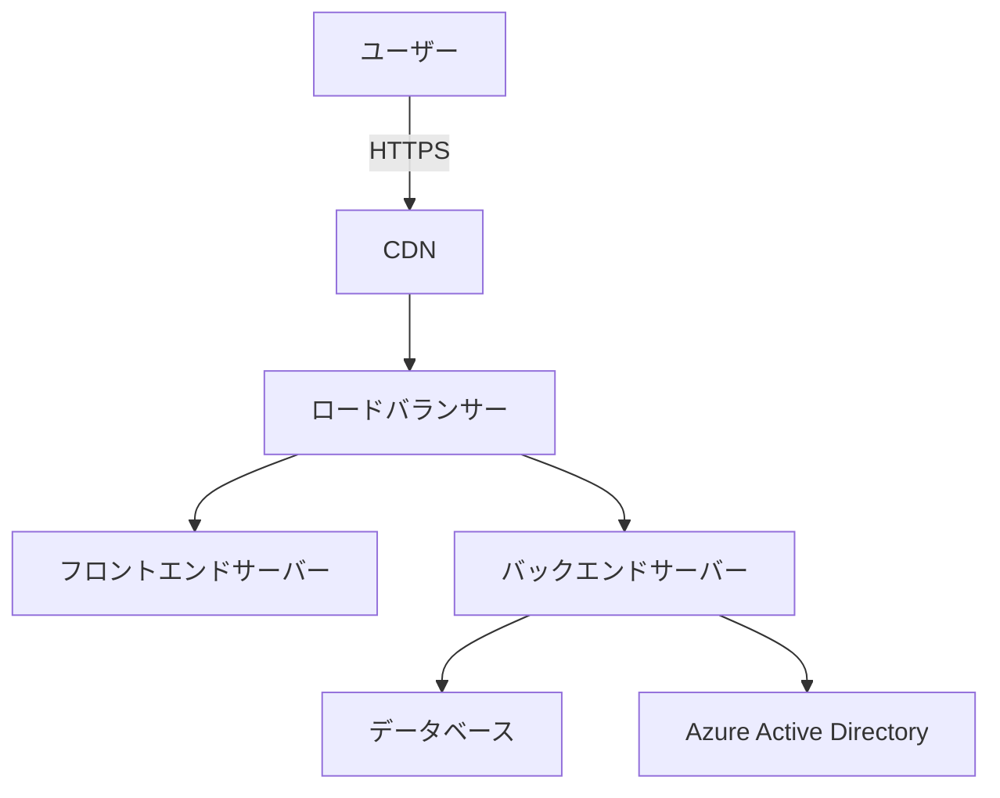

# 本番環境移行ガイド

## 1. 事前準備
### 1.1 環境要件確認
- [ ] Azureサブスクリプションの有効性確認
- [ ] ドメイン名の取得（例：it-management.example.com）
- [ ] 本番用SSL証明書の準備（Let's Encrypt推奨）
- [ ] ファイアウォール設定の見直し

### 1.2 設定ファイルの更新
```env
# .env.production
REACT_APP_API_BASE_URL=https://api.it-management.example.com
REACT_APP_MS_CLIENT_ID=本番用クライアントID
REACT_APP_MS_AUTHORITY=https://login.microsoftonline.com/テナントID
REACT_APP_REDIRECT_URI=https://it-management.example.com/auth/callback
```

## 2. インフラストラクチャ設定
### 2.1 ネットワーク構成


### 2.2 サーバー要件
| リソース | 仕様 |
|---------|------|
| フロントエンド | 2vCPU / 4GB RAM |
| バックエンド | 4vCPU / 8GB RAM |
| データベース | Azure SQL Standard Tier |

## 3. 移行手順
### 3.1 データベース移行
```powershell
# 開発環境からダンプ取得
.\scripts\db-export.ps1 -Environment Dev -Output backup.sql

# 本番環境へインポート
.\scripts\db-import.ps1 -Environment Prod -Input backup.sql
```

### 3.2 アプリケーションデプロイ
```bash
# フロントエンドビルド
cd frontend
npm run build:prod

# バックエンドデプロイ
cd ../backend
gunicorn --workers 4 --bind 0.0.0.0:5000 main:app
```

## 4. 認証設定の移行
1. Azureポータルで新しいアプリ登録を作成
2. 本番環境用のリダイレクトURIを追加：
   - `https://it-management.example.com/auth/callback`
3. APIアクセス許可の更新：
   - Microsoft Graph > User.Read.All
   - Azure Key Vault > Secret.Read

## 5. 検証手順
```bash
# ヘルスチェック
curl -I https://api.it-management.example.com/health

# 認証フローテスト
open https://it-management.example.com/login
```

## 6. モニタリング設定
```yaml
# prometheus.yml 追加設定
- job_name: 'it_management'
  metrics_path: '/metrics'
  static_configs:
    - targets: ['backend:5000', 'frontend:3000']
```

## 7. ロールバック手順
1. 前バージョンのDockerイメージを取得
```bash
docker pull registry.example.com/it-management:previous
```
2. データベースをリストア
```powershell
.\scripts\db-rollback.ps1 -Timestamp 20250315-1200
```

## 8. 運用開始後チェックリスト
- [ ] ログローテーション設定
- [ ] 自動バックアップ設定
- [ ] アラート通知設定（Slack/Teams連携）
