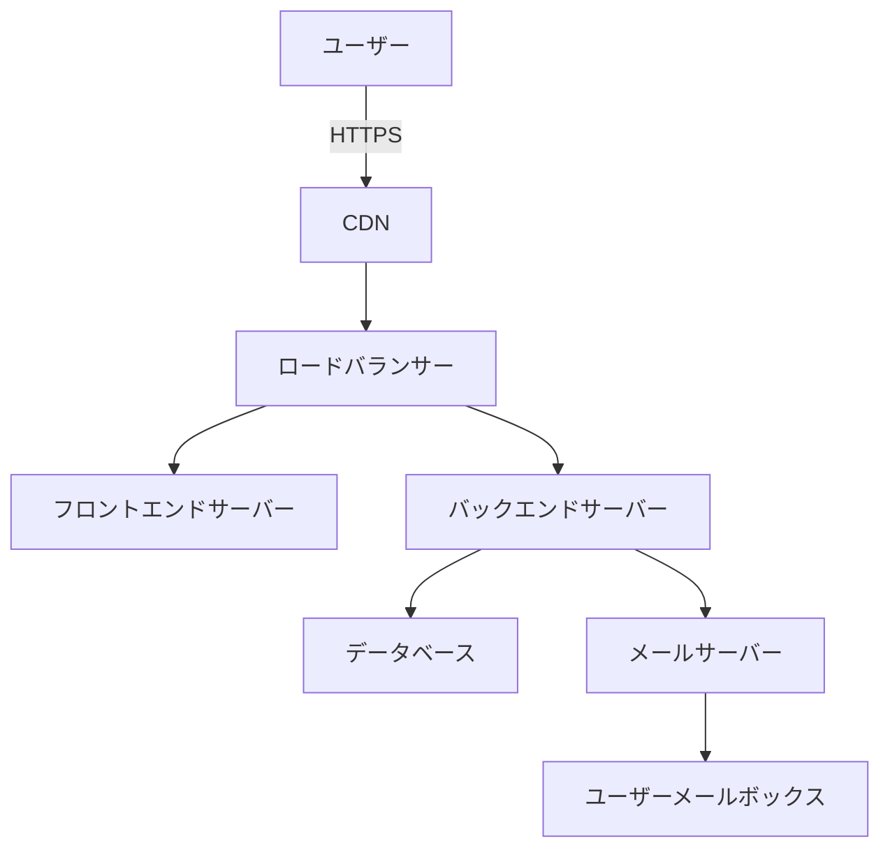

# 本番環境移行ガイド

## 1. 事前準備
### 1.1 環境要件確認
- [ ] サーバー環境の要件確認
- [ ] ドメイン名の取得（例：it-management.example.com）
- [ ] 本番用SSL証明書の準備（Let's Encrypt推奨）
- [ ] ファイアウォール設定の見直し
- [ ] メール送信サーバーの設定（レポート配信用）

### 1.2 設定ファイルの更新
```env
# .env.production
REACT_APP_API_BASE_URL=https://api.it-management.example.com
REACT_APP_SMTP_SERVER=smtp.example.com
REACT_APP_REPORT_SENDER=reports@example.com
```

## 2. インフラストラクチャ設定
### 2.1 ネットワーク構成


### 2.2 サーバー要件
| リソース | 仕様 |
|---------|------|
| フロントエンド | 2vCPU / 4GB RAM |
| バックエンド | 4vCPU / 8GB RAM |
| データベース | SQL Standard Tier |
| レポート生成サーバー | 4vCPU / 8GB RAM |

## 3. 移行手順
### 3.1 データベース移行
```powershell
# 開発環境からダンプ取得
.\scripts\db-export.ps1 -Environment Dev -Output backup.sql

# 本番環境へインポート
.\scripts\db-import.ps1 -Environment Prod -Input backup.sql
```

### 3.2 アプリケーションデプロイ
```bash
# フロントエンドビルド
cd frontend
npm run build:prod

# バックエンドデプロイ
cd ../backend
gunicorn --workers 4 --bind 0.0.0.0:5000 main:app
```

## 4. レポート機能の設定
1. レポート生成スケジューラの設定:
   ```bash
   # crontabの設定
   30 1 * * * /path/to/scripts/generate-daily-reports.sh  # 日次レポート(毎日1:30に実行)
   0 2 * * 1 /path/to/scripts/generate-weekly-reports.sh  # 週次レポート(毎週月曜2:00に実行)
   0 3 1 * * /path/to/scripts/generate-monthly-reports.sh # 月次レポート(毎月1日3:00に実行)
   ```

2. メール配信設定:
   ```yaml
   # mail-config.yml
   smtp_server: smtp.example.com
   port: 587
   use_tls: true
   sender: reports@example.com
   reply_to: no-reply@example.com
   subject_prefix: "[ITマネジメントシステム]"
   ```

3. レポートストレージの設定:
   - 生成されたレポートの保存先ディレクトリの作成
   - アクセス権限の設定
   - 自動クリーンアップポリシーの設定（古いレポートの削除）

## 5. 検証手順
```bash
# ヘルスチェック
curl -I https://api.it-management.example.com/health

# レポート生成機能テスト
curl -X POST https://api.it-management.example.com/api/reports/generate \
  -H "Content-Type: application/json" \
  -H "Authorization: Bearer $API_TOKEN" \
  -d '{"type":"system_overview","period":"today"}'
```

## 6. モニタリング設定
```yaml
# prometheus.yml 追加設定
- job_name: 'it_management'
  metrics_path: '/metrics'
  static_configs:
    - targets: ['backend:5000', 'frontend:3000', 'report-generator:5001']
```

## 7. ロールバック手順
1. 前バージョンのDockerイメージを取得
```bash
docker pull registry.example.com/it-management:previous
```
2. データベースをリストア
```powershell
.\scripts\db-rollback.ps1 -Timestamp 20250315-1200
```

## 8. 運用開始後チェックリスト
- [ ] ログローテーション設定
- [ ] 自動バックアップ設定
- [ ] アラート通知設定（Slack/Teams連携）
- [ ] レポート生成スケジューラの動作確認
- [ ] メール配信機能のテスト
- [ ] レポートデータの保持期間設定の確認
