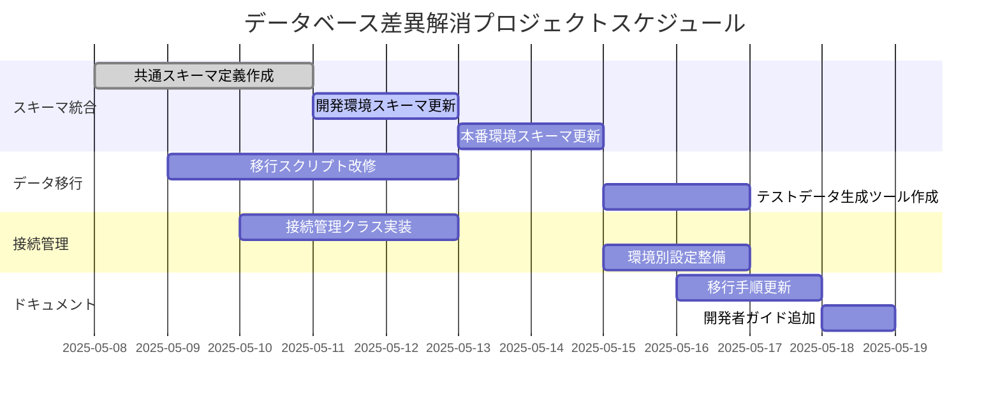

# データベース差異解消プロジェクト計画

## 概要
開発環境（SQLite）と本番環境（Azure SQL Edge）のデータベース差異を解消するためのプロジェクト計画書

## 目標
1. スキーマの統一（開発/本番環境で同一スキーマを使用）
2. データ移行プロセスの標準化
3. 接続管理方法の統一
4. ドキュメント整備

## 実施項目

### 1. スキーマ統合
- `database/schema-common.sql` の作成
  - 開発/本番環境のテーブルを統合したスキーマ定義
  - バージョン管理用のマイグレーションスクリプト追加
- 開発環境スキーマ更新
  - `backend/init_db.py` の改修
- 本番環境スキーマ更新
  - `production/database/schema.sql` の更新

### 2. データ移行スクリプト改修
- `scripts/db-migrate.ps1` の作成
  - スキーマ変換ロジック実装
  - データ型変換処理追加
- テストデータ生成ツール作成
  - `scripts/generate-test-data.ps1`

### 3. 接続管理統一
- `database/connection_manager.py` の作成
  - 環境に応じた接続文字列管理
  - 接続プーリング機能実装
- 環境別設定ファイル整備
  - `.env.development` (開発用)
  - `.env.production` (本番用)

### 4. ドキュメント更新
- `docs/Database-Migration-Guide.md` の更新
  - 新しいスキーマ図追加
  - トラブルシューティングセクション拡充
- 開発者向けガイド作成
  - `docs/Database-Development-Guide.md`

## スケジュール

## リスク管理
| リスク要因 | 影響度 | 対応策 |
|------------|--------|--------|
| スキーマ変更によるアプリケーション不具合 | 高 | 段階的な移行、十分なテスト実施 |
| データ移行中のダウンタイム | 中 | メンテナンスウィンドウを設定 |
| パフォーマンス低下 | 中 | インデックス再構築、クエリチューニング |

## 検証項目
1. 開発/本番環境で同一のスキーマが使用できること
2. データ移行スクリプトが正常に動作すること
3. 接続管理クラスが各環境で正しく動作すること
4. ドキュメントが最新化されていること