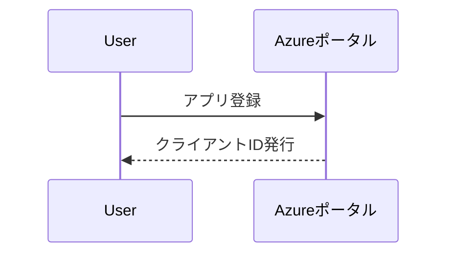

# Azureアプリケーション設定ガイド
<!-- 元ファイル: AzureApp-Setup-Guide.md -->

## 1. Azureポータルでの設定手順
### 1.1 アプリケーション登録


## 2. 権限設定
### 2.1 必要なAPI権限
| 権限タイプ | 権限名 | 説明 |
|-----------|--------|------|
| 委任 | User.Read | ユーザー基本情報閲覧 |
| アプリケーション | Directory.Read.All | ディレクトリ全体閲覧 |

## 3. 環境変数設定例
```env
# .env.production
AZURE_CLIENT_ID=xxxxxxxx-xxxx-xxxx-xxxx-xxxxxxxxxxxx
AZURE_TENANT_ID=xxxxxxxx-xxxx-xxxx-xxxx-xxxxxxxxxxxx