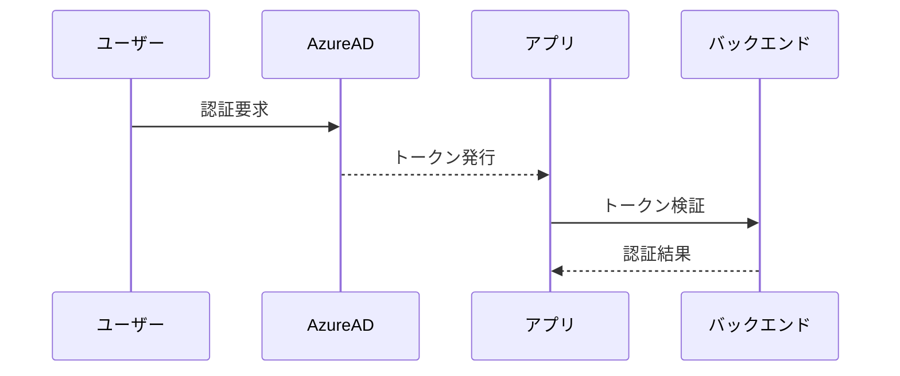

# Microsoft認証設定手順
<!-- 元ファイル: MS-Auth-Setup.md -->

## 1. 認証設定フロー


## 2. 設定手順
### 2.1 Azureポータル設定
1. アプリ登録完了
2. リダイレクトURI設定: `https://localhost:3000/auth/callback`

### 2.2 環境変数設定
```env
CLIENT_ID=xxxxxxxx-xxxx-xxxx-xxxx-xxxxxxxxxxxx
TENANT_ID=xxxxxxxx-xxxx-xxxx-xxxx-xxxxxxxxxxxx
AUTHORITY=https://login.microsoftonline.com/${TENANT_ID}
```

## 3. 設定検証チェックリスト
- [ ] トークン取得可能
- [ ] ユーザー情報取得可能
- [ ] 権限制御が機能