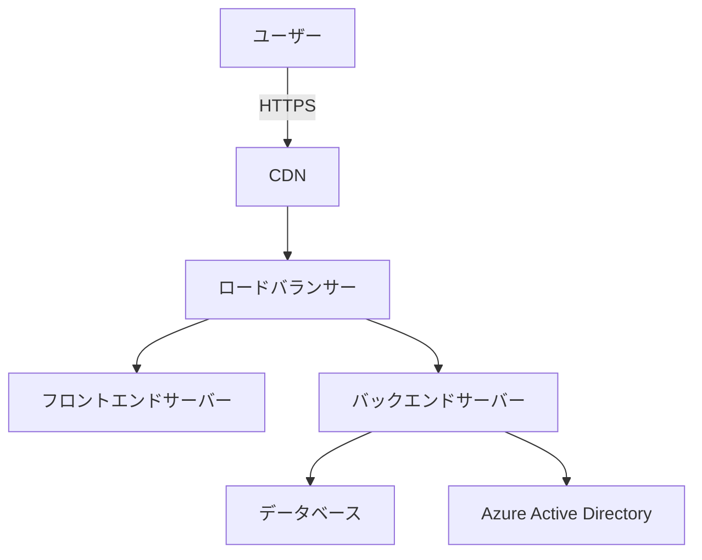

# ネットワークアーキテクチャ

## 概要
ITマネジメントシステムの本番環境ネットワーク構成について説明します。

## ネットワーク構成図

## サーバー要件

| リソース | 仕様 | 推奨インスタンスタイプ |
|---------|------|----------------------|
| フロントエンド | 2vCPU / 4GB RAM | Azure: B2s または AWS: t3.medium |
| バックエンド | 4vCPU / 8GB RAM | Azure: B4ms または AWS: t3.large |
| データベース | Azure SQL Standard Tier | 50GB ストレージ, 自動バックアップ有効 |

## ネットワークセキュリティ

### 必要なポート
- 80/443: Webトラフィック（HTTPSリダイレクト含む）
- 5000: バックエンドAPI（内部ネットワークのみ）
- 3306: データベース（内部ネットワークのみ）

### ファイアウォール設定
- フロントエンド: インバウンド 80/443のみ許可
- バックエンド: フロントエンドからの5000のみ許可
- データベース: バックエンドからの3306のみ許可

## DNSレコード設定

| レコード名 | タイプ | 値 |
|-----------|------|-----|
| it-management | A | ロードバランサーのIPアドレス |
| api.it-management | A | APIゲートウェイのIPアドレス |
| www.it-management | CNAME | it-management.example.com |